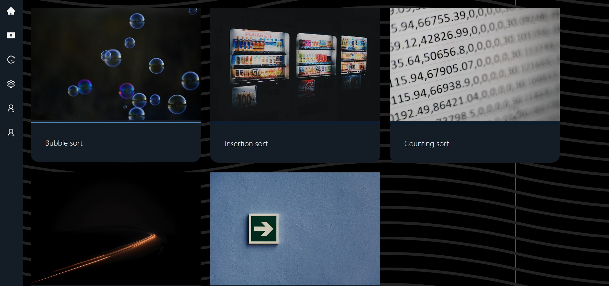

# Sorting Algorithms Visualization

## Table of contents

- [General info](#general-info)

- [Technologies](#technologies)

- [Usage](#usage)

- [Sources](#updates)

- [Updates](#updates)

## General info

This is the frontend part of the project for university course.
Backend part is located [here](#).

## Technologies

- ReactJS
- TypeScript
- Webpack
- p5
- zustand

## Usage

Site currently isn't available anywhere for public access.

## Sources

- [Example p5 bubble sort simulation from docs](https://p5js.org/examples/simulate-bubble-sort.html)

- [Example p5 quick sort simulation from docs](https://p5js.org/examples/simulate-quicksort.html)

- [Building MPA app with React](https://itnext.io/building-multi-page-application-with-react-f5a338489694)
